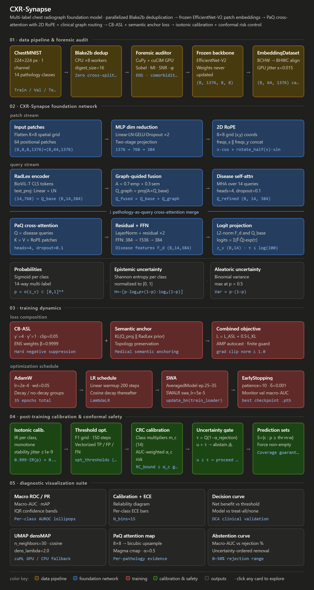

# CXR-Synapse: Graph-Guided Pathology Attention Foundation Model

[](https://pytorch.org)
[](https://tensorflow.org)
[](https://www.docker.com)
[](https://developer.nvidia.com/cuda-toolkit)
[](LICENSE)

Official implementation of **CXR-Synapse**, a clinical-grade foundation framework for multi-label chest X-ray (CXR) classification. The architecture routes localized chest representations using pathology-specific RadLex queries, 2D Rotary Position Embeddings (2D RoPE), and structured clinical graph adjacency maps.

The pipeline features a hardware-accelerated forensic dataset auditor to eliminate cross-split data leakage, evaluates probability calibration via Asymmetric Isotonic Regression (AIR), and assesses risk control boundaries using conformal prediction.


## 📌 System Architecture




## 📂 Repository Structure

```text
├── Extraction/
│   ├── extraction_pipeline.py     # TF-based spatial feature extraction
│   └── cxr_embeddings/            # Target directory for serialized features
├── audit.py                       # Parallel bitwise hashing & GPU morphology profiling
├── analyze_cardinality.py         # Multi-label pathology distribution analysis
├── train.py                       # CXR-Synapse training script (CB-ASL & SWA)
├── visualizer.py                  # Clinical diagnostic visualization suite
├── requirements.txt               # Base dependencies list
├── LICENSE                        # Project licensing
└── README.md                      # This documentation file
```


## 🛠️ Requirements & System Prerequisites

### Hardware Requirements
- **GPU**: NVIDIA Tensor Core GPU (Ampere architecture or newer recommended, e.g., RTX 3090/4090, A100, H100)
- **VRAM**: Minimum 16 GB for training, 24 GB+ recommended for large-batch operations
- **Storage**: ~50 GB of free space for raw datasets and serialized embeddings

### Software Requirements
- **Host OS**: Linux (Ubuntu 20.04/22.04 LTS recommended)
- **NVIDIA Container Toolkit** installed on host
- **Docker Engine** (v20.10 or newer)


## ⚙️ Environment Setup

Due to conflicting dependency requirements for compiling `tensorflow-text` and the PyTorch SWA training suite, the pipeline is split into two isolated Docker container environments.

### Environment A: Base Clinical Model Container (NVIDIA NGC)
*Used for forensic auditing, model training, and diagnostic visualization.*

Launch the PyTorch container from your host terminal, mapping your project directory to `/workspace`:

```bash
docker run --gpus all -it --rm \
  -v "$(pwd):/workspace" \
  -p 8888:8888 \
  --ipc=host \
  --ulimit memlock=-1 \
  --ulimit stack=67108864 \
  nvcr.io/nvidia/pytorch:26.03-py3
```

Once inside the container shell, install the processing, medical image, and visualization dependencies:

```bash
# Install clinical, scientific, and medical imaging backends
pip install medmnist torchcp transformers sentencepiece scikit-image \
            seaborn pandas timm opencv-python-headless umap-learn \
            statsmodels pypng

# Install CUDA-accelerated auditing backends
pip install cupy-cuda12x cucim-cu12
```

### Environment B: Feature Extraction Container (TensorFlow GPU)
*Used exclusively for running the heavy pre-trained feature extraction pipeline.*

Launch this container in a separate shell:

```bash
docker run --gpus all -it --rm \
  -v "$(pwd):/tf/notebooks" \
  tensorflow/tensorflow:2.20.0-gpu-jupyter \
  bash -c 'apt-get update && \
           apt-get install -y libcudnn9-cuda-12 && \
           ldconfig && \
           apt-get remove -y libcudnn8 && \
           pip install medmnist transformers tensorflow-text==2.20.0 opencv-python-headless torch tqdm && \
           exec bash'
```

## 📐 Technical Flowcharts

### System Pipeline & Ingestion Flow

```mermaid
flowchart TD
    subgraph INGEST["📥 DATA INGESTION & FORENSIC AUDIT"]
        direction TB
        A1([ChestMNIST\n224×224 Raw Images]) --> A2[/Split: Train · Val · Test/]
        A2 --> A3["🔐 Parallel Blake2b Hashing\n(CPU multiprocessing, digest_size=16)"]
        A3 --> A4{"Cross-Split\nDuplicate Detected?"}
        A4 -- "Yes → Remove" --> A5[🗑️ Filtered Out]
        A4 -- "No → Retain" --> A6[(Clean Deduplicated\nDataset)]
        A6 --> A7["🔬 ForensicDatasetAuditor\n(GPU · CuPy · cuCIM)"]
        A7 --> A7a["Sobel Edge Density\nPixel Variance Heatmap\nMutual Information\nSNR Distribution\nComorbidity Matrix"]
    end

    subgraph EMBED["⚙️ EMBEDDING PIPELINE (OFFLINE)"]
        direction TB
        B1["Frozen EfficientNet-V2 Backbone\n(Pre-trained)"] --> B2["Feature Maps\n(B, C=1376, H=8, W=8)"]
        B2 --> B3["Layout Alignment\n(B,C,H,W) → (B,H,W,C)"]
        B3 --> B4[("💾 Serialized Embeddings\n.pt files\ntrain · val · test")]
    end

    subgraph LOADER["📦 DATALOADER"]
        direction LR
        C1["EmbeddingDataset\n(B, 8, 8, 1376)"] --> C2["GPU Jitter Augmentation\nε ~ N(0, 0.015)"]
        C2 --> C3["DataLoader\nbatch_size=64"]
    end

    subgraph MODEL["🧠 CXR-SYNAPSE FOUNDATION NETWORK"]
        direction TB
        D1["Input Patches\n(B, 64, 1376)"] --> D2["MLP Dim Reduction\n1376 → 768 → 384\nLinear·LN·GELU·Drop·Linear·LN·GELU"]
        D2 --> D3["Projected Patches\n(B, 64, 384)"]
        D3 --> D4["PaQ Cross-Attention\n+ 2D RoPE Module"]
        D4 --> D5["Logits z_v\n(B, 14)"]
    end

    subgraph TRAIN["🏋️ TRAINING LOOP"]
        direction TB
        E1["CB-ASL Loss\n(γ⁻=4, γ⁺=1, clip=0.05)\n+ ENS Class Weights (β=0.9999)"] --> E2["Semantic Anchor Loss\nKL(Q_proj ‖ RadLex Prior)"]
        E2 --> E3["Total Loss\nL = L_ASL + 0.5 · L_KL"]
        E3 --> E4["AdamW + LR Warmup\n+ Cosine Annealing\nEpochs 1–35"]
        E4 --> E5["SWA (Epochs 25–35)\nAveragedModel + SWALR\n+ BN Update"]
        E5 --> E6["EarlyStopping\n(patience=10, δ=0.001)\n→ Best Checkpoint .pth"]
    end

    subgraph CALIB["🎯 POST-PROCESSING CALIBRATION"]
        direction TB
        F1["Val Probabilities\n(sigmoid logits)"] --> F2["Class-Wise Asymmetric\nIsotonic Regression\n(per-class IR fit)"]
        F2 --> F3["Calibrated Probabilities\n0.999·IR(p) + 0.001·p"]
        F3 --> F4["Threshold Optimization\nvectorized F1 grid search\n→ opt_thresholds (14,)"]
    end

    subgraph CONFORMAL["🛡️ UNCERTAINTY-GATED CONFORMAL RISK CONTROL"]
        direction TB
        G1["Epistemic Uncertainty\n(Shannon Entropy, per class)"] --> G2["Uncertainty Threshold\nτ = Q(1−α_rejection)"]
        G2 --> G3{"u > τ ?"}
        G3 -- "YES" --> G4[/"⚠️ REJECTED\n(High Uncertainty)"/]
        G3 -- "NO" --> G5["CRC Calibration\nClass-Wise Multipliers m_c\nAUC-weighted α_c bounds"]
        G5 --> G6["Prediction Sets\np ≥ thr·m_c·w_c\n→ force non-empty"]
        G6 --> G7[/"✅ Guaranteed Clinical\nPrediction Set"/]
    end

    subgraph VIZ["📊 DIAGNOSTIC VISUALIZATION SUITE"]
        direction LR
        H1["Macro ROC · PR Curves\nPer-Class AUROC · ECE"]
        H2["DensMAP UMAP\nLatent Manifold"]
        H3["PaQ Attention\nHeatmap Overlay"]
        H4["Decision Curve\nAbstention Curve"]
    end

    INGEST --> EMBED
    EMBED --> LOADER
    LOADER --> MODEL
    MODEL --> TRAIN
    MODEL --> CALIB
    CALIB --> CONFORMAL
    CONFORMAL --> VIZ

    style INGEST fill:#E8F4FD,stroke:#2196F3,stroke-width:2px,color:#000
    style EMBED fill:#FFF3E0,stroke:#FF9800,stroke-width:2px,color:#000
    style LOADER fill:#F3E5F5,stroke:#9C27B0,stroke-width:2px,color:#000
    style MODEL fill:#E8F5E9,stroke:#4CAF50,stroke-width:2px,color:#000
    style TRAIN fill:#FCE4EC,stroke:#E91E63,stroke-width:2px,color:#000
    style CALIB fill:#E0F2F1,stroke:#009688,stroke-width:2px,color:#000
    style CONFORMAL fill:#FFF8E1,stroke:#FFC107,stroke-width:2px,color:#000
    style VIZ fill:#EDE7F6,stroke:#673AB7,stroke-width:2px,color:#000
```



### Model Architecture & Forward Pass

```mermaid
flowchart LR
    subgraph INPUTS["INPUTS"]
        direction TB
        P1(["Patch Tensor\n(B, 8, 8, 1376)"])
        R1(["RadLex Embeddings\n(14, 768)\nBioViL-T CLS tokens"])
        ADJ(["Adjacency Matrix A\n(14, 14) normalized\nEmpirical + Semantic\nα-blend = 0.7"])
    end

    subgraph DIMRED["① DIM REDUCTION"]
        direction TB
        P1 --> FLAT["Reshape\n(B, 64, 1376)"]
        FLAT --> MLP["MLP Projection Head\nLinear(1376→768)\nLayerNorm · GELU · Dropout\nLinear(768→384)\nLayerNorm · GELU"]
        MLP --> PROJ["Projected Patches\n(B, 64, 384)"]
    end

    subgraph ROPE["② 2D RoPE GENERATION"]
        direction TB
        PROJ --> GRID["Build 8×8 Grid\ngrid_x, grid_y ∈ ℝ⁶⁴"]
        GRID --> FREQ["inv_freq = 1 / 10000^(2i/dim)\n∈ ℝ⁴⁸"]
        FREQ --> OUTER["freqs_x = outer(grid_x, inv_freq)\nfreqs_y = outer(grid_y, inv_freq)\n∈ ℝ^(64×48)"]
        OUTER --> EMB["emb = cat[freqs_x, freqs_y] → ℝ^(64×96)\nexpand → ℝ^(64×384)"]
        EMB --> COSSIN["cos(emb), sin(emb)\n(1, 64, 384)"]
        COSSIN --> ROTATE["x_rotated = x·cos + rotate_half(x)·sin\nrotate_half: [-x₂, x₁] interleave"]
        ROTATE --> RPATCHES["RoPE Patches\n(B, 64, 384)"]
    end

    subgraph QUERYPATH["③ QUERY CONSTRUCTION (Graph-Guided)"]
        direction TB
        R1 --> TPROJ["text_proj\nLinear(768→384) + LayerNorm\n→ Base Queries Q_base\n(B, 14, 384)"]
        ADJ --> GPROJ["graph_proj: Linear(384→384)\nQ_graph = graph_proj(A × Q_base)\n(B, 14, 384)"]
        TPROJ --> QFUSE["Query Fusion\nQ_fused = Q_base + Q_graph\n(B, 14, 384)"]
        GPROJ --> QFUSE
        QFUSE --> SELFATTN["Multi-Head Self-Attention\n(Q_fused → Q, K, V)\nheads=4, dropout=0.1"]
        SELFATTN --> QNORM["LayerNorm + Residual\nQ_refined (B, 14, 384)"]
    end

    subgraph CROSSATTN["④ PaQ CROSS-ATTENTION"]
        direction TB
        QNORM --> XATTN["Multi-Head Cross-Attention\nQ = Q_refined\nK = V = RoPE_Patches\nheads=4, dropout=0.1"]
        RPATCHES --> XATTN
        XATTN --> XNORM["LayerNorm + Residual\nhidden_cross (B, 14, 384)"]
        XNORM --> FFN["FFN\nLinear(384→1536) · GELU · Drop\nLinear(1536→384)"]
        FFN --> DISF["Disease Features F_d\nLayerNorm (B, 14, 384)"]
    end

    subgraph LOGIT["⑤ LOGIT & UNCERTAINTY"]
        direction TB
        DISF --> NORM_D["L2-Normalize F_d"]
        QNORM --> NORM_Q["L2-Normalize Q_base"]
        NORM_D --> COSDOT["Scaled Cosine Similarity\nlogits = Σ(F̂_d · Q̂) · exp(τ)\nτ = learnable, clamp ≤ log(100)\n→ z_v (B, 14)"]
        NORM_Q --> COSDOT
        COSDOT --> PROB["σ(z_v) → Probabilities\n(B, 14)  ∈ [0,1]"]
        PROB --> EPIST["Epistemic Uncertainty\nH = −[p·log₂p + (1−p)·log₂(1−p)]\n∈ [0,1] per class → mean over 14"]
        PROB --> ALEAT["Aleatoric Uncertainty\nVar = p·(1−p)\nBinomial variance"]
    end

    INPUTS --> DIMRED
    DIMRED --> ROPE
    DIMRED --> QUERYPATH
    ROPE --> CROSSATTN
    QUERYPATH --> CROSSATTN
    CROSSATTN --> LOGIT

    style INPUTS fill:#E3F2FD,stroke:#1565C0,color:#000
    style DIMRED fill:#E8F5E9,stroke:#2E7D32,color:#000
    style ROPE fill:#FFF3E0,stroke:#E65100,color:#000
    style QUERYPATH fill:#F3E5F5,stroke:#6A1B9A,color:#000
    style CROSSATTN fill:#FCE4EC,stroke:#880E4F,color:#000
    style LOGIT fill:#E0F7FA,stroke:#006064,color:#000
```



### Execution State Machine

```mermaid
stateDiagram-v2
    direction TB

    state "TRAINING PHASE (Epochs 1–35)" as TRAIN {
        direction TB
        state "Forward Pass" as FWD {
            [*] --> BatchFeats: (B, 64, 1376) + GPU Jitter ε
            BatchFeats --> ModelLogits: CXR-Synapse forward(x) → z_v (B,14)
        }

        state "CB-ASL Loss Branch" as ASL_BRANCH {
            direction LR
            ENS_WEIGHTS: ENS Class Weights\nw_c = 1/ENS_c\nENS_c = (1−β^n_c)/(1−β)\nβ = 0.9999
            ASL_CORE: Asymmetric Cross-Entropy\nγ⁻=4 · γ⁺=1 · clip=0.05\nHard Negative Suppression
            CB_ASL: L_ASL = −mean[y·log σ·(1−p)^γ⁺\n+ (1−y)·log(1−σ_clip)·p_clip^γ⁻] · w_c
            ENS_WEIGHTS --> CB_ASL
            ASL_CORE --> CB_ASL
        }

        state "Semantic Anchor Loss Branch" as KL_BRANCH {
            direction LR
            RADLEX_PRIOR: Static RadLex Prior\nS_prior = softmax(Q_BioViL·Q_BioViL^T / 0.1)
            QUERY_TOPO: Current Query Topology\nS_curr = log_softmax(Q_proj·Q_proj^T / 0.1)
            KL_LOSS: L_KL = KL(S_curr ‖ S_prior)\nAnchors query topology to\nmedical semantics
            RADLEX_PRIOR --> KL_LOSS
            QUERY_TOPO --> KL_LOSS
        }

        state "Combined Objective" as COMBINE {
            TOTAL_LOSS: L_total = L_ASL + 0.5 · L_KL\nNumerical Guard: skip if not finite
            BACKWARD: Scaled Backward (AMP)\nGradClip norm ≤ 1.0
            OPTIMIZER: AdamW (lr=2e-4, wd=0.05)\nLambdaLR: Warmup(200 steps) + CosineDecay
            TOTAL_LOSS --> BACKWARD
            BACKWARD --> OPTIMIZER
        }

        state "SWA Phase (Epochs 25–35)" as SWA_PHASE {
            SWA_UPDATE: AveragedModel.update_parameters()\nSWALR cyclic schedule\nswa_lr=5e-5 anneal=3
            BN_UPDATE: update_bn(train_loader, swa_model)
            EARLY_STOP: EarlyStopping on val AUC\npatience=10 δ=0.001\n→ Save best .pth
            SWA_UPDATE --> BN_UPDATE
            BN_UPDATE --> EARLY_STOP
        }

        FWD --> ASL_BRANCH
        FWD --> KL_BRANCH
        ASL_BRANCH --> COMBINE
        KL_BRANCH --> COMBINE
        COMBINE --> SWA_PHASE
    }

    state "CALIBRATION PHASE (Val Set)" as CALIB {
        direction TB
        state "Isotonic Calibration" as ISO {
            GET_VAL_PROBS: Collect val probs p̂_c ∈ [0,1]^N per class
            FIT_IR: Fit IsotonicRegression(increasing=True)\nper class c on (p̂_c, y_c)\nwith stability jitter ±1e-9
            APPLY_IR: p_cal = 0.999·IR(p̂) + 0.001·p̂\nclamp ∈ [1e-7, 1−1e-7]
            GET_VAL_PROBS --> FIT_IR
            FIT_IR --> APPLY_IR
        }
        state "Threshold Optimization" as THROP {
            GRID: Grid = percentiles(10→99.9, 150 steps)\nper-class unique thresholds
            F1_MATRIX: Vectorized TP/FP/FN over entire grid\npreds_matrix = p ≥ grid[:]
            BEST_THR: Best thr_c = argmax F1_c(grid)\nfallback: 99.5th percentile + ε
            GRID --> F1_MATRIX
            F1_MATRIX --> BEST_THR
        }
        ISO --> THROP
    }

    state "CONFORMAL RISK CONTROL (CRC) CALIBRATION" as CRC_CALIB {
        direction TB
        UNCERT_GATE: Uncertainty Threshold τ\nτ = Quantile(u_cal, 1−α_rejection)\nFilter: keep only u ≤ τ
        AUC_WEIGHTS: Class Weights\nw_c = 1 + λ·(1 − AUC_c)  λ=0.6
        ALPHA_RISK: Per-Class Risk Limits α_c\ne.g. α_Cardiomeg=0.05  α_Fibrosis=0.30
        CRC_LOOP: For each class c, scan multipliers m ∈ [0.01,10]\ntest_thr = opt_thr_c · m · w_c\nempirical_risk = FP(m)/N_cal\nRC_bound = (N/(N+1))·risk + 1/(N+1)\nSelect smallest m : RC_bound ≤ α_c
        STORE_M: Store global_multipliers[c] = m_c*
        UNCERT_GATE --> AUC_WEIGHTS
        AUC_WEIGHTS --> ALPHA_RISK
        ALPHA_RISK --> CRC_LOOP
        CRC_LOOP --> STORE_M
    }

    state "INFERENCE / PREDICTION GATE" as INFER {
        direction TB
        state check_u <<choice>>
        TEST_INPUT: Test Sample\np_test (B,14)  u_test (B,)
        TEST_INPUT --> check_u
        check_u --> REJECTED: u_test > τ\n⚠️ ABSTAIN\n(High Epistemic Risk)
        check_u --> ACCEPTED: u_test ≤ τ
        ACCEPTED --> FINAL_SET: final_thr = opt_thr · m* · w\nS = {c : p_c ≥ final_thr_c}\nForce non-empty if |S|=0\n→ Guaranteed Coverage Set
    }

    TRAIN --> CALIB: Best checkpoint loaded
    CALIB --> CRC_CALIB: Val probs + opt_thresholds
    CRC_CALIB --> INFER: τ, m*, w deployed
```



## 🚀 Execution Pipeline

Follow these execution steps sequentially to run the clinical pipeline from raw dataset ingestion to final diagnostics.

### Step 1: Feature Extraction (Environment B)
Run the isolated feature extraction pipeline inside your **TensorFlow GPU Container** shell:

```bash
cd /tf/notebooks/Extraction
python extraction_pipeline.py
```
* **Output**: Generates serialized features `train_embeddings.pt`, `val_embeddings.pt`, and `test_embeddings.pt` (1376-dimensional tensors) mapped inside `/workspace/Extraction/cxr_embeddings_10percent`.


> 💡 **Note**: All subsequent processes must be executed inside the **NVIDIA NGC Container** (Environment A) working from `/workspace`:

```bash
cd /workspace
```

### Step 2: Forensic Verification & Leakage Cleanse
Execute the parallel hashing and spatial-variance analysis engine to clean validation and test splits:

```bash
python audit.py
```
* **Output**: Removes cross-split duplicates and writes automated data quality profiles: `forensic_audit_train.pdf`, `forensic_audit_val.pdf`, and `forensic_audit_test.pdf`.

### Step 3: Distribution & Cardinality Assessment
Evaluate multi-label pathology co-occurrence matrices across the cleansed boundaries:

```bash
python analyze_cardinality.py
```

### Step 4: Foundation Model Training
Launch the core optimization loop utilizing class-balanced asymmetric loss (CB-ASL), semantic anchor regularization, and SWA scheduling:

```bash
python train.py
```
* **Output**: Tracks real-time validation macro-AUROC. Best-performing weights and final SWA parameters are saved as `CXR_Synapse_Foundation_Seed_[seed].pth`.

### Step 5: Clinical Diagnostics & Conformal Visualization Suite
Deploy the model on unseen test sets, computing calibration, uncertainty metrics, and generating localized heatmaps:

```bash
python visualizer.py
```
* **Output**: Generates publication-ready figures (PDF/PNG format) depicting:
  - Macro-ROC and Precision-Recall Curves
  - Isotonic Calibration curves
  - Conformal risk coverage intervals
  - localized PaQ query-attention maps overlaid on spatial grids

## 🎓 Citation & Academic Reference

If you incorporate this clinical architecture, deduplication protocol, or the attention-routing mechanisms in your research, please cite the work as follows:

```bibtex
@mastersthesis{cxrsynapse2025,
  author    = {Nika Natsvlishvili},
  title     = {CXR-Synapse: Clinical Graph-Guided Multi-Label Attention Foundations for Thoracic Imaging},
  school    = {Master's Thesis Project},
  year      = {2026}
}
```